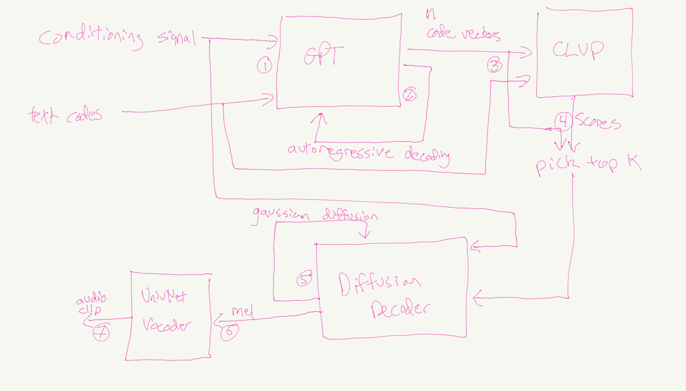
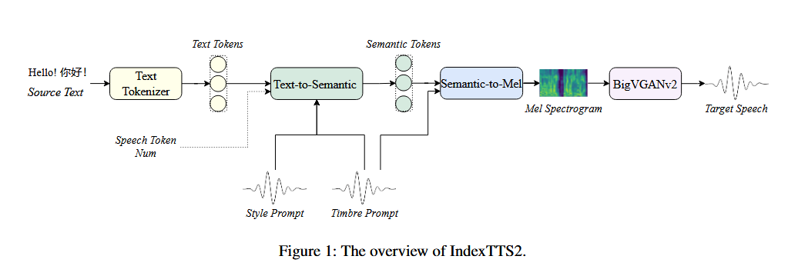

Much has been written about the different categories of [generative models](https://deepgenerativemodels.github.io/notes/): VAEs, GANs, flow-based models, etc. Since 2022, the two types of generative models I seem to hear most frequently discussed are Transformers and Diffusion models. These two models made headlines because ChatGPT was powered by transformers and DALL-E 2 (as well as Stable Diffusion) was powered by diffusion. However, in reading about these models, I had a bit of a tough time understanding how exactly transformers differ from diffusion models. After all, they seem to rely on the same fundamental concepts of encoding and decoding. Furthermore, like I mentioned in a previous [post](https://8t88.github.io/blog/tts_arch_trends), some audio generation systems such as [TorToise](https://github.com/neonbjb/tortoise-tts) incorporate both these types of models. So, is there a sharp distinction between the two? The answer, as it turns out, is that the two are indeed distinct, but they can overlap if the architecture of the diffusion model uses the transformer as a backbone.   
While I won’t dive into the low-level mathematical details of how these two models work, given that others have [already](https://yang-song.net/blog/2021/score/) [done](https://angusturner.github.io/generative_models/2021/06/29/diffusion-probabilistic-models-I.html) [so](https://benanne.github.io/2022/01/31/diffusion.html) with far greater depth and insight than I could, in this post I will highlight the key conceptual insight I think provides a meaningful distinction, that of denoising. Additionally, I will take a look at the specifics of how this implementation plays out by exploring some generative audio systems that make use of diffusion and transformer components, pointing out where and how each is implemented to help make the difference more concrete.

## Quick Overview

### Transformers

At this point, most of us have at least some familiarity with the transformer. It is a neural network architecture that relies on data embedding, an encoder and/or decoder, and some form of attention. The Transformer was initially set out in a 2017 paper and used an autoencoder structure, but the systems that really brought the transformer acclaim, the GPT family, are decoder-only systems. Andrej Karpathy’s [nanoGPT](https://github.com/karpathy/nanogpt) is an easy reference for understanding this: we see that the layers are feedforward \+ attention, without an initial encoding of the embedded text data. These text-generating models predict sequences that follow an initial prompt

### Diffusion

Diffusion models, sometimes called score-based models, are a class of generative models that learn to reverse a ‘forward’ process of adding noise to a dataset. They were outlined in a [2015 paper](https://arxiv.org/abs/1711.05772v2) but got a lot more attention five years later from the paper [Denoising Diffusion Probabilistic Models](https://arxiv.org/abs/2006.11239v2).   
Diffusion models also use an encoding/decoding structure to transform the input. The 2020 paper used a U-Net for this. During inference, the U-Net takes as input either an image (in the case of the original denoising diffusion models paper) or a latent encoded image (as in [latent diffusion](https://arxiv.org/abs/2112.10752)) and outputs the predicted noise. This predicted noise is then subtracted from the input to get a slightly less noisy image; that process is repeated a number of times before passing the result to the decoder to get the final image output.  
To really understand diffusion models, I’d recommend [this](https://towardsdatascience.com/the-art-of-noise/) in-depth walkthrough of the implementation of a diffusion model with a U-net, as well as [this](https://colab.research.google.com/gist/anton-l/f3a8206dae4125b93f05b1f5f703191d/diffusers_training_example.ipynb#scrollTo=584739c5-83f5-4077-8379-89a7c9ff1bf2) colab notebook. An important point, which took me a while to realize, is that the U-Net gets run during each step, rather than each step representing a layer of the U-Net, as this [diagram](https://raw.githubusercontent.com/patrickvonplaten/scientific_images/master/stable_diffusion.png) illustrates. Also as a brief aside, diffusion models don’t simply predict as much noise as possible and remove it during each step. Instead, they use noise schedulers to control the rate this is performed. You can find a good writeup of that [here](https://medium.com/@lambdafluxofficial/developers-guide-to-hugging-face-diffusers-part-3-deep-dive-into-scheduler-e88fe2371b74), as well as a detailed notebook walkthrough [here](https://colab.research.google.com/github/huggingface/notebooks/blob/main/diffusers/diffusers_intro.ipynb#scrollTo=RwSsSoRVY136).

## Key Difference: Denoising

Now that we’ve given a high-level overview of what these two models are, we can identify the key aspect that separates a diffusion model from a standard transformer.  
Looking at the output of the system, we realize that the transformer model isn’t necessarily trying to predict noise, it is trying to predict the next token in a sequence. For the GPT series, this was focused on language, thus the training set consisted of for example wikipedia articles. The training process started with a sentence and the model tried to predict the next word in the sentence, with the loss comparing how close the prediction is to the actual next word.  
For diffusion models, however, the prediction aspect of the model isn’t actually the result. Instead, the prediction within the model is noise, which is used in the denoising module to generate the output. In other words, the noise is predicted within the system, then that prediction is used to produce the final output, whether that’s an image, audio clip, etc. The difference is a bit subtle but significant.

## Overlap

Denoising is necessary for a diffusion model, but that doesn’t mean that the two models are mutually exclusive. In the initial paper, the diffusion model relies on a U-Net for its backbone, which is a convolutional neural network that takes in the image and downsamples then upsamples the data. However, [as has been pointed out,](https://lilianweng.github.io/posts/2021-07-11-diffusion-models/#model-architecture) diffusion models can instead use the transformer as a backbone. This happens when attention is added in between the layers, making the transformer (embedding through convolutions followed by attention) the backbone of the model.  
This architecture setup is known as a [Diffusion-transformer](https://arxiv.org/abs/2212.09748) (DiT). A [DiT](https://encord.com/blog/diffusion-models-with-transformers/) uses transformers in a latent diffusion process, where a simple prior (like Gaussian noise) is gradually transformed into the target image. Stable Diffusion 3 uses a DiT, as seen in this [diagram](https://i.imgur.com/D9y0fWF.png).

## Implementation in TorToise and IndexTTS2

Let’s look at some real-world examples by using one of my favorite ML topics: audio generation. 

### Tortoise

  
From the TorToise [design doc](https://nonint.com/2022/04/25/tortoise-architectural-design-doc/)

We’ll first take a look at [TorToise](https://arxiv.org/pdf/2305.07243), an audio generation text-to-speech system released in 2023\.   
As described in the paper, TorToise takes the advances made by image generation in autoregressive transformers and DDPMs and applies them to speech synthesis. In this we find an example of when the transformer and diffusion models are separate, as you can see in the architecture drawing above. The transformer first predicts audio codes, then the diffuser generates spectrograms from the codes. So what does this implementation look like?  
TorToise uses a transformer to create speech tokens from the encoded speech and text inputs, resulting in “a probabilistic understanding of how text and speech relate to one another given a contextual voice”. It then uses a Diffusion model to decode the compressed speech representations into a wave file. Rather than using a U-net, the diffusion model “is composed of a flat stack of 10 alternating full-attention layers and residual conv blocks. The hidden dimensionality is 1024 with 16 attention heads. This model clocks in at 292M parameters.” (There are three other models in the TorToise system, but we are only focusing on these two for now.)

### IndexTTS2

  
[Source](https://arxiv.org/pdf/2506.21619)

[IndexTTS2](https://arxiv.org/abs/2506.21619) (2025) is another high-quality text-to-speech system that has a particular focus on controlling speech duration and on achieving independent control over timbre and emotion. The model comprises three core modules: the Text-to-Semantic (T2S) module, the Semantic-to-Mel (S2M) module, and the Vocoder.  
The T2S module uses an autoregressive transformer framework to “generate semantic tokens from text, timbre/style prompts, and an optional speech token count”. The S2M module uses flow-matching modeling to sample from a noise distribution for generating mel-spectrograms. Flow-matching also transforms noise into structured data, though the method is a bit different from denoising diffusion models. We won’t go into detail here, but [this article](https://harshm121.medium.com/flow-matching-vs-diffusion-79578a16c510) provides a good comparison between the two.   
You can see the IndexTTS team’s flow-matching implementation in their repo [here](https://github.com/index-tts/index-tts/blob/main/indextts/s2mel/modules/flow_matching.py); additionally, you should also note their [implementation](https://github.com/index-tts/index-tts/blob/main/indextts/s2mel/modules/diffusion_transformer.py) of a diffusion transformer, which could presumably be substituted for the flow-matching module. 

## Final Thoughts

Transformers and Diffusion models both incorporate the advances in machine learning around latent spaces, encoding/decoding, and attention. Their design and implementation are typically dictated by the nature of the task they are trying to accomplish. Diffusion models are excellent at synthesizing high-fidelity visual and auditory outputs, while transformers thrive on modeling and predicting sequential data. Sometimes though, as seen in the use cases above, combining the two produces a very powerful combination that results in the incredible realism of the generated text, audio, and video we see today.