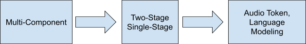
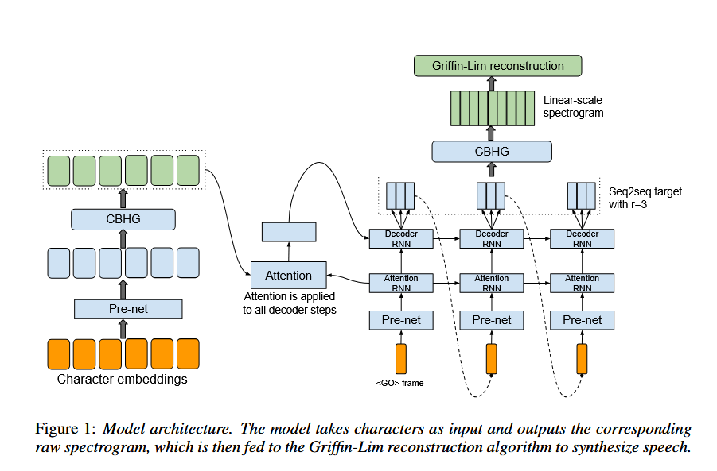
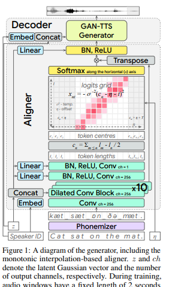
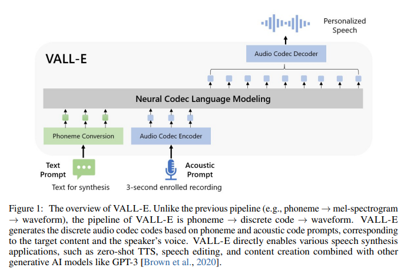

In my [previous post](https://8t88.github.io/blog/tts_timeline.html), I walked through major open-source models in the TTS audio generation space. The development of these models over time has followed different trends in terms of design decision tradeoffs as researchers aimed to improve the quality and performance of their models. In this post, I’m going to take a look at some of these key trends and the reasoning behind the design decisions. This post will be slightly more technical than the previous one. I’ll be focusing on the innovations that have been developed in the audio ML space, but I’ll be assuming you have some knowledge of how generative AI systems work (the basic ideas behind transformers, diffusion models, etc.)

As has taken place across all domains within machine learning, we’ve seen the natural progression of increased scaling in dataset size and model size. Beyond these increased magnitudes though, researchers and engineers have settled on several design decisions aimed at improving the speed and quality of audio generation. The two main topics I want to highlight are the general trends around the simplification of end-to-end pipeline system design, and the utilization of generative models including VAEs, Transformers, Adversarial Networks, and Diffusion models.

# Pipeline Simplification

{:width="50%"}

### Component-based Architecture

Prior to the shift in using Machine Learning for text to speech, traditional TTS systems performed the conversion by using multi-stage systems made from components such as text analysis, duration modeling, acoustic modeling, and a vocoder. These components would typically be implemented and tuned individually by audio engineers. While it worked well for its time, these systems were often brittle and difficult to expand upon because of their complexity.

### Two-Stage Systems

A fundamental paradigm in the growth of ML was the increased emphasis on using the data to do the heavy lifting through neural nets, rather than individually tailored algorithms. To this end, [WaveNet](https://arxiv.org/pdf/1609.03499) (2016) simplified the multi-component pipeline by replacing the vocoder and acoustic model components with a neural network structure; however, the neural nets were still conditioned on linguistic features such as the [logarithmic fundamental frequency](https://www.audiolabs-erlangen.de/resources/MIR/FMP/C3/C3S1_SpecLogFreq-Chromagram.html) and phone durations.   
Following this, more models continued this trend toward a general two-stage system, where the text was converted to intermediate representations such as mel-spectrograms, and then those intermediate forms were converted into the final waveform. [Tacotron](https://arxiv.org/pdf/1703.10135) (2017) did this by synthesizing speech from characters, while having an intermediate component that produced spectrograms to be passed to a reconstruction algorithm (Griffin-Lim). or a vocoder.  

[Tacotron Architecture](https://arxiv.org/pdf/1703.10135)

This was similarly the case with [Deep Voice 3](https://research.baidu.com/uploads/5ac03da1e126a.pdf) (2017), which fed textual features (e.g. characters, phonemes, stresses)  into various vocoder parameters, such as mel-band spectrograms, linear-scale log magnitude spectrograms, fundamental frequency, spectral envelope, and aperiodicity.

This trend gradually continued up to the 2020s, when researchers really tried to lean more fully into getting rid of these component-based systems by replacing them with single stage end-to-end models. These systems would take in waveforms, pass them through transformer/diffusion architectures, then output the speech result.   
[EATS](https://arxiv.org/abs/2006.03575) (2020) was a clear example of this; it operated directly on character or phoneme input sequences and produced raw speech audio output. It was composed of two high-level submodules: an aligner, which processed the raw input sequence and converted them into a latent feature space; and the decoder, which turned those features into 24 kHz audio waveforms.   

[EATS architecture](https://arxiv.org/pdf/2006.03575)

[VITS](https://arxiv.org/pdf/2106.06103) (2021) tried to go even further by making a true single stage pipeline using VAEs guided by normalizing flows and an adversarial training process

### Audio Tokens and Language Modeling  {#audio-tokens-and-language-modeling}

After experimenting with this strategy for a couple of years, developers took a slight step back toward the component based approach by modeling discrete audio tokens then using those to generate the speech results. This coincided with the move toward adopting transformer architectures (more on that in the [next section](#model-technologies)). Some early examples of these were [AudioLM](https://research.google/blog/audiolm-a-language-modeling-approach-to-audio-generation/) (2022) and [VALL-E](https://www.microsoft.com/en-us/research/project/vall-e-x/) (2023). VALL-E innovated by replacing intermediate acoustic representations of mel spectrograms with discrete [audio codec](https://en.wikipedia.org/wiki/Audio_codec) codes.  

[VALL-E Architecture](https://arxiv.org/pdf/2301.02111)

As of Now, the audio token approach is still producing the top results, but many models in 2025 attempted to return to the single stage simplification seen earlier, particularly in single-transformer models like [Llasa](https://llasatts.github.io/llasatts/) and end-to-end pipelines like [Sesame CSM](https://github.com/SesameAILabs/csm)

# Model Technologies {#model-technologies}

Prior to the mid-2010s, TTS systems relied on classical signal processing and statistical modeling to speech waveforms. As the machine learning and then generative ai space took off, developers incorporated these new algorithms and models to generate more realistic speech results.

### CNNs and RNNs

In the second half of the 2010s, the leading edge of ML development took the form of Deep Learning composed of [CNNs](https://en.wikipedia.org/wiki/Convolutional_neural_network) and [RNNs](https://en.wikipedia.org/wiki/Recurrent_neural_network). Consequently, systems like WaveNet, Tacotron, and Deep Voice all incorporated these architectures into their pipelines.

### Encoders/Decoders, Transformers, and Adversarial Nets

By the end of the 2010s and going into the 20s, developers started to incorporate the leading [generative models](https://deepgenerativemodels.github.io/notes/) into their systems.   
Adversarial training was added as a component to the training of several TTS systems, EATS being an early example, followed by VITS.   
Additionally, new systems moved from using CNNs and RNNs to making use of encoder-decoder structures and Transformers. DeepVoice 3 in 2018 was an early example of this, it used a convolutional encoder-decoder and was attention-based. Additionally, VITS used [VAEs](https://deepgenerativemodels.github.io/notes/vae/) in tandem with the adversarial components mentioned above.   
However, the use of Transformers in TTS architecture really started getting more widely adapted around 2022, when the [trend moved toward TTS as a language modeling task](#audio-tokens-and-language-modeling) rather than a direct conversion mechanism. This is because the process of converting data to tokens lent itself naturally to the Transformer’s structure.

### Diffusion Models

On top of this, many of the models added a diffusion component on top of the transformer encoder/decoder mechanisms to generate the final audio output and produce a more natural sound. [TorToise](https://github.com/neonbjb/tortoise-tts) (2023) and [StyleTTS2](https://arxiv.org/abs/2306.07691) (2023) were notable in this regard. This fusion of transformers and diffusion models has continued to the present, with models like [IndexTTS2](https://index-tts.github.io/index-tts2.github.io/) (2025) using this approach.

# Bonus: Autoregressive modeling

### Pros and Cons

[Autoregressive (AR) models](https://deepgenerativemodels.github.io/notes/autoregressive/) are models where outputs are modeled based on previous values.   
Unlike the other trends we’ve highlighted that have a general direction of development, the use of Autoregressive modeling in TTS systems has actually gone back and forth over the years, as  developers have weighed the tradeoffs between the two.  
AR architectures give high-quality outputs and generally improve results, but they can be slow. They are also sequential and thus inherently unparallelizable Consequently, Non-Autoregressive (NAR) methods may be chosen when speed or performance is of high value, depending on the use case. Additionally, NAR methods can work better with some of the other trends that architectures have taken; in particular the exponential growth of datasets and parameter counts can be enabled by the use of NAR methods, to get the system to actually finish training. However, NAR models have challenges of their own, such as difficulty in maintaining alignment between input text and synthesized speech.

### Back and Forth

Starting with WaveNet and continuing on in others such as Tacotron and Deep Voice, an  autoregressive architecture was used as it produced positive results.   
[WaveGlow](https://arxiv.org/abs/1811.00002) (2018) was an early attempt at moving away from using an autoregressive system, followed by EATS and VITS. This didn’t take hold too strongly though, and many other systems continued to use AR methods. For instance, VALL-E used an autoregressive model for coarse tokens and a Non-Autoregressive model for fine residual tokens. [E2-TTS](https://www.microsoft.com/en-us/research/project/e2-tts/) (2024) on the other hand, was fully Non-Autoregressive.  
In the latest stage of events, AR has been incorporated once again, with Llasa, [Spark-TTS](https://github.com/SparkAudio/Spark-TTS) (2025), and [VibeVoice](https://microsoft.github.io/VibeVoice/) (2025) all incorporating autoregressive components into their system.

# Final Thoughts

Here in 2026 there is still much R&D being conducted in the audio generation space. Researchers continue to experiment with architectures to achieve new levels of realism in speech generation. Some other developments we’ve seen recently are:

- Distillation into smaller models (often with Llama3 as backbone). This is in contrast to the increased model sizes mentioned above, and is of interest because it shows high quality outputs can be produced from much smaller inference  
- Compute resources strategies, in the same vein as inference-time focus with reasoning models. Llasa demonstrates that scaling training-time and inference-time compute can significantly refine prosody and accuracy  
- Multilanguage; largely a component of the increased data size as well as the language modeling paradigm shift

Stay tuned for future posts, where we’ll take a closer look at some of the design components we’ve discussed, and eventually take a deeper dive into the models themselves.