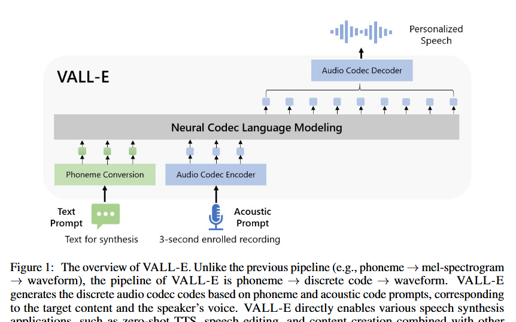
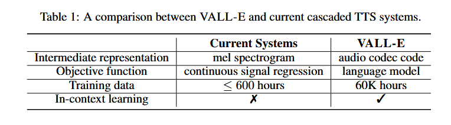
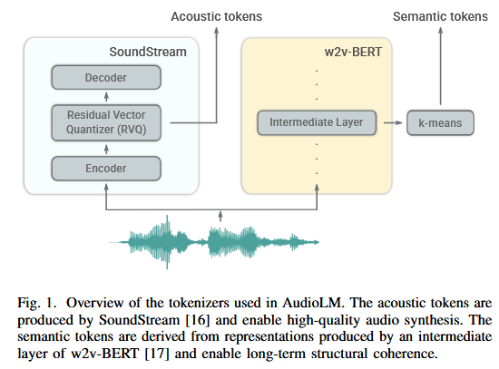
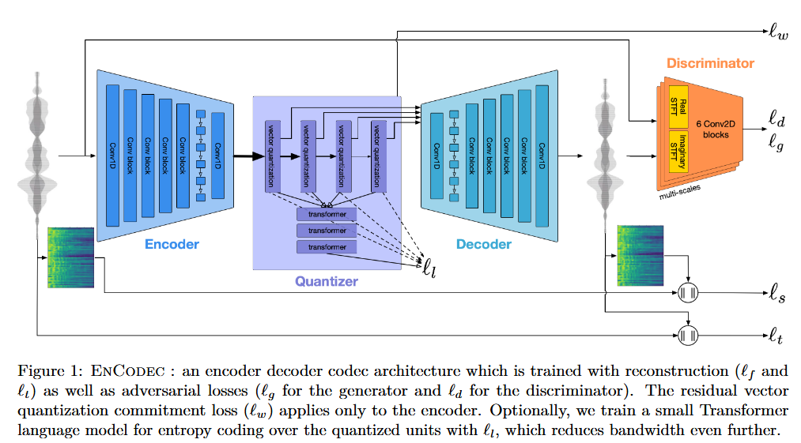
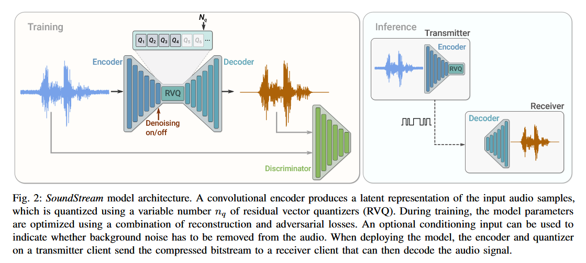
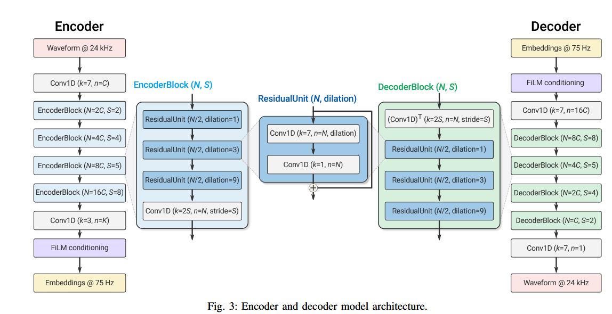

As I mentioned in my [last post](https://8t88.github.io/blog/tts_arch_trends), one of the big developments in TTS architecture was the shift toward text to speech as a language modeling task with the use of audio tokens in the modeling process. In this post we’re going to dive into what that actually means and looks like in practice. We’ll start by giving a little bit of background looking briefly at the uses of latent spaces in earlier neural architectures. We’ll then see how latent spaces were applied to the audio domain, and we’ll take a closer look at the use of audio codes in this regard.  
So to begin, let’s explain what we mean by “latent spaces”.

# Latent Spaces and Encoders

A [Latent space](https://www.ibm.com/think/topics/latent-space) is “a compressed representation of data points that preserves only essential features that inform the input data’s underlying structure”. These representations have been increasingly used in deep learning models over the last decade with the goal of teaching a model to capture information by transforming the data into the latent space. The general idea is that you reduce the high dimensionality of the data you are training with into a lower dimensional space that can be used to produce your outputs, usually for either classification or generation.

The idea of intermediate representations was already being developed in deep learning neural network architectures like CNNs and RNNs, since the middle layers of these systems can be seen as a form of latent space, but the importance of the concept really started to take off with the rise in popularity of autoencoders. This is because the autoencoder is encoding the data input into an intermediate representation as a separate entity, which the decoder then uses to reconstruct the original result. 

Latent spaces got a big boost of popularity from image generation with [Latent Diffusion Modeling](https://arxiv.org/pdf/2112.10752) which was productionized into Stable Diffusion. Instead of operating directly in “pixel space”, this diffusion model first mapped the image to a latent space before completing the denoising process. The results maintained a high quality result, while providing impressive speed improvements as well as better generalizability.   

In our domain of interest, generative audio models like [VITS](https://github.com/daniilrobnikov/vits2) and [Deep Voice 3](https://arxiv.org/abs/1710.07654) included latent spaces in their systems, whereby the audio inputs (the wave file and text segment) would be transformed to a lower dimensional subspace then transformed back again into the result. Thus the latent space was in a sense serving as a link between text and audio.

# Language Modeling

Earlier text-to-speech machine learning systems had focused on models that learned to translate the text into a mel-spectrogram and then decode the audio from there. In this framework, the model tries to learn the conversion mapping from the text to its appropriate audio. Inspired by the success of generative text models such as the different GPT series that model a “language space” to be used in producing long text outputs, researchers decided to approach audio models in a similar way, aiming to model high-level, long-term structure that can be used in generating audio.

The idea of language modeling is to turn the problem from a melspectrogram production then vocoder conversion into a mapping to latent “language space”, and then decode the audio from that latent space. The language space is produced by the audio codecs which create quantized “codes” from the inputs (the text to be turned into audio, as well as any additional speaker information). The theory is that the quantized codes compress all that information about the content of the audio (the actual words) as well as the information about the prosody of the speech into the latent space. With the information encoded, the decoder part of the codec is used to produce the final audio.

 Two big research efforts came out around the same time that led the charge in this shift toward language modeling within generative audio: [VALL-E](https://arxiv.org/pdf/2301.02111) from Microsoft at the end of 2022 and [AudioLM](https://arxiv.org/pdf/2209.03143) from Google at the beginning of 2023\. 

VALL-E aimed to “regard TTS as a conditional language modeling task rather than continuous signal regression”. It did so by making use of latent spaces and by using a ton of data, scaling training data to 60,000 hours of speech.   

[Source](https://arxiv.org/pdf/2301.02111)


[Source](https://arxiv.org/pdf/2301.02111)

AudioLM used a two-token approach: semantic tokens from [w2v-BERT](https://arxiv.org/abs/2108.06209) for capturing “local dependencies (e.g., phonetics in speech, local melody in piano music) and global long-term structure (e.g., language syntax and semantic content in speech; harmony and rhythm in piano music)”; and acoustic tokens from an audio codec for capturing audio waveform structure and details.  

	[Source](https://arxiv.org/pdf/2209.03143)

Because codecs and the intermediate representations they produce play such an integral role in this language modeling process, let’s take a closer look at the codecs used by these two models and examine in detail what the conversion process and results look like in practice.

## Audio Tokens and Codecs

In order to carry out this language modeling, the audio ML models used latent spaces in the form of [codecs](https://en.wikipedia.org/wiki/Codec), algorithms that encode data streams, in this instance the data streams being either the text of the spoken words or the audio itself in the form of a wave file. VALL-E used an algorithm called [EnCodec](https://arxiv.org/pdf/2210.13438), and AudioLM used one called [SoundStream](https://arxiv.org/pdf/2107.03312).

EnCodec has three main components: an encoder network, a quantization layer, and a decoder.  
The whole system is trained end-to-end and minimizes a reconstruction loss over both the time and frequency domain. This diagram from the EnCodec paper displays the entire pipeline from end to end, showcasing the three components:  
  
[Source](https://arxiv.org/pdf/2210.13438)

SoundStream relies on a model architecture made up of a fully convolutional encoder/decoder network and a residual vector quantizer (RVQ). It also includes adversarial and reconstruction losses to allow the generation of high-quality audio content from quantized embeddings. The encoder receives as input a waveform and produces a sequence of embeddings at a lower sampling rate, which are quantized by the RVQ. The decoder can then reconstruct an approximation of the original waveform.   
The diagram below from the SoundStream paper gives an overview of the full system:  
  
[Source](https://arxiv.org/pdf/2107.03312)

The paper also includes a breakdown of the steps of the model:  
  
	[Source](https://arxiv.org/pdf/2107.03312)

**Code example**  
To really drive home what an audio codec is doing, let’s [walk through](https://github.com/facebookresearch/encodec) what it looks like to encode some audio in python using EnCodec.

First, we'll load the EnCodec libraries and a sample audio file

```
from datasets import load_dataset, Audio  
from transformers import EncodecModel, AutoProcessor  
import torch

# dummy dataset, however you can swap this with an dataset on the 🤗 hub or bring your own  
librispeech_dummy = load_dataset("hf-internal-testing/librispeech_asr_dummy", "clean", split="validation")

# load the model + processor (for pre-processing the audio)  
model = EncodecModel.from_pretrained("facebook/encodec_24khz")  
processor = AutoProcessor.from_pretrained("facebook/encodec_24khz")

# cast the audio data to the correct sampling rate for the model  
librispeech_dummy = librispeech_dummy.cast_column("audio", Audio(sampling_rate=processor.sampling_rate))  
audio_sample = librispeech_dummy[0]["audio"]["array"]  
print(f"Input audio shape: {audio_sample.shape}")
```

```Input audio shape: (140520,)```

With that in place, we can preprocess the inputs and encode the audio sample

```
inputs = processor(raw_audio=audio_sample, sampling_rate=processor.sampling_rate, return_tensors="pt")

encoder_outputs = model.encode(inputs["input_values"], inputs["padding_mask"])
```

Examining the results, we see that the encoder has created a tensor in the latent space with a much smaller size than the input tensor. The actual values aren’t interpretible to us, as they represent a result in latent space.

```
detail_tensor = encoder_outputs['audio_codes']  
print(f"Tensor data type: {detail_tensor.dtype}")  
print(f"Tensor shape: {detail_tensor.shape}")  
print(f"Number of dimensions (rank): {detail_tensor.ndim}")  
print(f"Total number of elements: {detail_tensor.numel()}")
```
```
Tensor data type: torch.int64  
Tensor shape: torch.Size([1, 1, 2, 440])  
Number of dimensions (rank): 4  
Total number of elements: 880
```
To complete the process, we can call the decoder on the encoded value. 
```
audio_values = model.decode(encoder_outputs.audio_codes, encoder_outputs.audio_scales, inputs["padding_mask"])[0]

print(f"Tensor data type: {audio_values.dtype}")  
print(f"Tensor shape: {audio_values.shape}")  
print(f"Number of dimensions (rank): {audio_values.ndim}")  
print(f"Total number of elements: {audio_values.numel()}")
```
```
Tensor data type: torch.float32  
Tensor shape: torch.Size([1, 1, 140520])  
Number of dimensions (rank): 3  
Total number of elements: 140520
```
When we play the resulting audio, we see it is close to the original, but slightly distorted, since the latent space encoding uses a statistical variational process, rather than being purely deterministic.

# Moving Forward

With these advancements at the end of 2023/beginning of 2024, language modeling moved forward as the dominant method for TTS. Cutting edge research continues to use this paradigm; for instance, [SparkTTS](https://github.com/SparkAudio/Spark-TTS) (2025) used a novel tokenizer called BiCodec, separating semantic tokens for meaning and global tokens for speaker content. [VibeVoice](https://microsoft.github.io/VibeVoice/) (2025) used a specialized speech tokenizer as well.  
Experimentation with new ideas continues. Some researchers are investigating the move from discrete to [continuous](https://arxiv.org/pdf/2507.09834) codes. Others are experimenting with a return to the simplification of the end-to-end pipeline system, [Sesame’s CSM](https://github.com/SesameAILabs/csm) (2025) being a great example of that. Nevertheless, language modeling and audio codecs continue to play a key role in generative modeling of the audio space.
