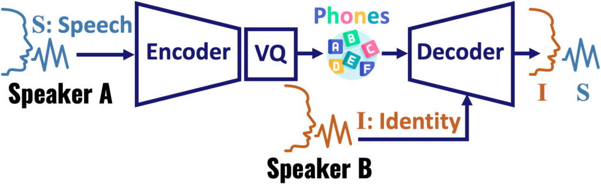
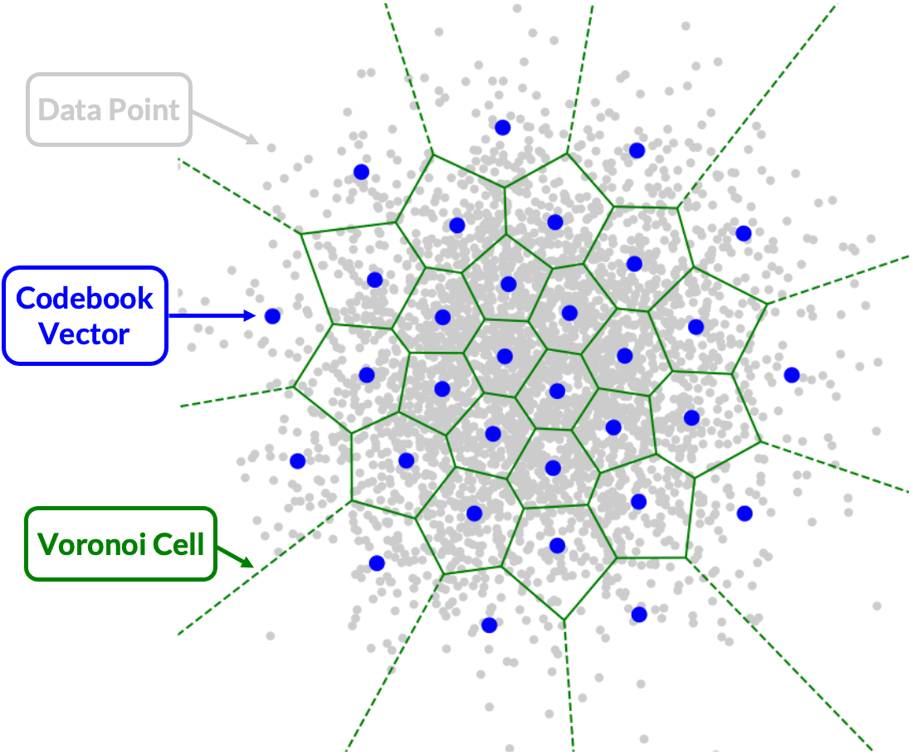
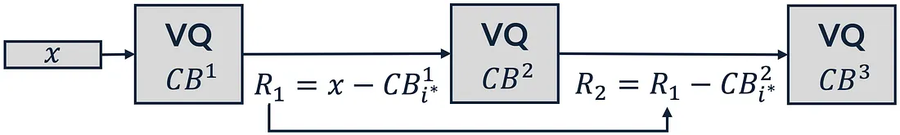
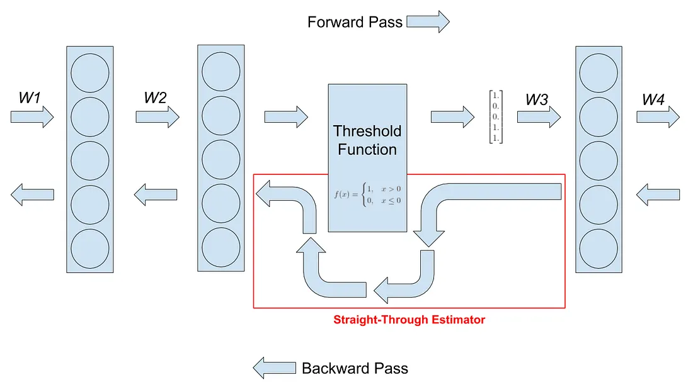
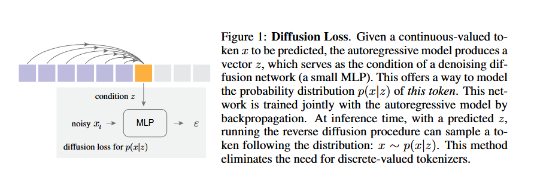
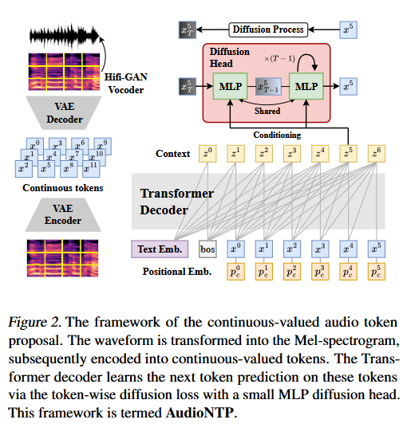

Quantization has become highly [incorporated across the range](https://developer.nvidia.com/blog/model-quantization-concepts-methods-and-why-it-matters/) of Machine Learning and GenAI use cases. Aimed at finding gains in storage and computational efficiency, this method is largely used in systems that deal with image and audio data classification and generation, although potential use cases exist in other areas such as [time series](https://medium.com/@waleed.physics/the-future-of-time-series-modeling-tokenization-through-vector-quantization-77ed3bc745d8). Quantization helps to reduce memory requirements and speeds up computation, while trading off some level of accuracy.  
   
It is important to realize though that depending on context quantization may be applied to different parts of the machine learning pipeline. I hear it used most often in the context of quantization of weights, where the format of model parameters are reduced to lower-precision values, e.g. from FP32 to FP8. Quantization of weights typically involves some rounding and/or clippling around a “zero point”, as well as decisions around how much of the parameter space you want to quantize and when you want quantization to take place in the training process. Broadly speaking, you have two options: PTQ and QAT. Post-training quantization (PTQ) takes place after the training has occurred, whereas [Quantization-Aware Training](https://www.ibm.com/think/topics/quantization-aware-training) (QAT) is incorporated into the training process.

Another important context though where quantization gets applied is in the data itself. Because we work with data of such large quantities and shapes, methods have been developed to quantize the data for use during training and inference. We’ve actually seen this concept before, when we took a look at [audio codecs](https://8t88.github.io/blog/latent_space_neural_codecs). In this post I want to dive deeper into the process of what data quantization actually looks like, highlighting the pros and cons to this tool, and also take a look at a possible alternative. As before, I’ll explore these ideas with my favorite use case: audio generation.

## Vector Quantization in Audio Codecs

### Codec Refresher

As a quick review, an audio codec is a system that compresses the information contained in audio data (i.e. the waveform) into latent space. The results of this compression are called “codes”.  
Vector Quantization (VQ) forms a key component of the codec. In our real-world example, [SoundStream](https://arxiv.org/pdf/2107.03312) runs the audio waveform through an encoder then applies Residual Vector Quantization (RVQ) to the encoded audio data, after which the result is run through the decoder, thus producing the audio tokens.   
So the overall process looks like: continuous data inputs get translated into continuous latent representations, then the quantization maps continuous latent representations into discrete embeddings before being further transformed. This process is incorporated into the overall machine learning pipeline that generates audio, as the below picture illustrates.  
 
[source](https://towardsdatascience.com/interpretable-latent-spaces-using-space-filling-vector-quantization-e4eb26691b14/)

### Quantization Processes

So what does the mechanism of Vector Quantization actually look like? This is a different process from the quantization used for model parameters. In the data quantization context we are not simply truncating the precision; instead, we are trying to map each data point to the closest low-precision value by using a distance function to calculate the space between data which is typically very high-dimensional, thus maintaining a semantic accuracy while achieving data compression,. VQ commonly uses clustering methods such as K-means to cluster similar parts of the spectrogram. It then maps these clustered data points to the nearest codebook point.   
A codebook is a collection of representative vectors (codewords), and each input feature vector is assigned to the nearest codeword in the codebook. The index of the assigned codeword in the codebook then becomes a discrete token.   
 
Vector Quantization Operation \[[source](https://towardsdatascience.com/interpretable-latent-spaces-using-space-filling-vector-quantization-e4eb26691b14/)\]

If you want to examine the finer details of vector-quantization, [this](https://github.com/lucidrains/vector-quantize-pytorch) repo provides examples of the different implementations. Furthermore, [this](https://huggingface.co/blog/ariG23498/understand-vq) post from Hugging Face gives a good walkthrough of the steps involved in quantization, showing the process of flattening, computing distance, and selecting the closest codebook vector.

### VQ Varieties

There are many different types of vector quantization methods; some of the most well-studied include:

* Residual Vector Quantization (RVQ): A technique that approximates high-dimensional vectors by selecting elements from a series of dictionaries, iteratively minimizing the quantization error  
* Linde-Buzo-Gray (LBG) algorithm: A popular method for designing codebooks using a hierarchical clustering approach  
* Generalized Residual Vector Quantization (GRVQ): An improved version of RVQ that demonstrates better performance in terms of quantization accuracy and computational efficiency  
* Improved Residual Vector Quantization (IRVQ): Another improved version of RVQ that further enhances its performance

[This](https://www.activeloop.ai/resources/glossary/residual-vector-quantization/) blog post dives into the specifics of these different types of vector quantization, and provides useful illustrations

RVW, the method SoundStream uses, has been around for [decades](https://ieeexplore.ieee.org/abstract/document/480761), but its incorporation into Generative AI was made popular with [VQ-VAE](https://arxiv.org/abs/1711.00937), a model introduced in the paper “[Neural Discrete representation Learning](https://proceedings.neurips.cc/paper/2017/file/7a98af17e63a0ac09ce2e96d03992fbc-Paper.pdf)” by Oord et al.  
RVQ works by iteratively minimizing the quantization error, which is the difference between the original vector and its approximation. 

   
	[source](https://medium.com/data-science/optimizing-vector-quantization-methods-by-machine-learning-algorithms-77c436d0749d)

To incorporate RVQ into your deep learning model, you need a trick to complete backpropagation, since the quantization doesn’t have a gradient. A key insight of VQ-VAE, which allowed the model to actually get trained, was the Straight-through estimator (STE) identified in the diagram below. STE calculates the gradient for each layer and passes it back by skipping over the quantization function.

  
[source](https://hassanaskary.medium.com/intuitive-explanation-of-straight-through-estimators-with-pytorch-implementation-71d99d25d9d0)

If you want to dive even deeper, some other interesting VQ methods to learn about are:

- [Noise Substitution in Vector Quantization for Machine Learning (NSVQ)](https://medium.com/data-science/improving-vector-quantization-in-vector-quantized-variational-autoencoders-vq-vae-915f5814b5ce): “a technique in which the vector quantization error is simulated by adding noise to the input vector, such that the simulated noise would gain the shape of original VQ error distribution.“  
- [Space-Filling Vector Quantization (SFVQ)](https://towardsdatascience.com/interpretable-latent-spaces-using-space-filling-vector-quantization-e4eb26691b14/): “mapping input data points on a space-filling curve (rather than only mapping data points exclusively on codebook vectors as what we do in normal VQ) “

## Continuous Tokens

As a refresher, there are a few different options for audio generation system architectures:

* Transformer architecture on discrete audio tokens; incorporating the VQ methods we talked about above; used by systems such as [IndexTTS2](https://arxiv.org/abs/2506.21619)   
* Diffusion model; examples include [AudioLDM 2](https://arxiv.org/pdf/2308.05734), as well as [Tango 2](https://arxiv.org/pdf/2404.09956), which is coupled with the decoder of a VAE (turning the latent representation to a mel-spectrogram) followed by a vocoder to produce the waveform  
* Auto-regressive Transformer on continuous audio tokens, where the diffusion aspect is used to model the continuous token then the transformer predicts the next continuous token

As you likely know, the general idea of LLMs were based on autoregressive models applied to discrete space, i.e. language and vocabulary. These systems were then applied on image space, despite it being more of a continuous domain. To accomplish this, the data would be vector-quantized and fed into a next-token predictor.  
However, if we didn’t want to use VQ to produce discrete tokens to be used in the generative audio models, what would continuous tokens in audio ML, i.e. the third option, look like?

The paper [Autoregressive Image Generation without Vector Quantization](https://arxiv.org/pdf/2406.11838) lays out a method to apply autoregressive models in a continuous-valued space (in this case image data) by modeling the per-token probability distribution using a diffusion procedure. This paper points out that the basic autoregressive idea of “predicting next tokens based on previous ones”  does not depend on predicting values that are continuous. Instead, all you really need is a loss function and a sampler. The loss function measures the per-token probability distribution, which is used to build model distributions to be sampled. Discrete-valued representations are convenient in this instance because they can be modeled by a categorical distribution using cross-entropy loss and sampling based on softmax. To apply this to the continuous domain though, the paper instead uses a Diffusion Loss function  (in the score matching sense) to model the per-token probability and samples from the resulting distribution. The system predicts a vector for each token, which is then fed into a diffusion model as a conditioning vector to guide the model. Thus the input and target can be continuous-valued data.

  
			[source](https://arxiv.org/pdf/2406.11838)

The paper also combines standard autoregressive models and masked generative models into a general framework wherein the masked autoregressive models “ predict multiple output tokens simultaneously in a randomized order, while still maintaining the autoregressive nature of “predicting next tokens based on known ones” …  This leads to a masked autoregressive (MAR) model that can be seamlessly used with Diffusion Loss.“

Using these concepts, we can apply the idea to the continuous data in the audio domain.  The paper [Generative Audio Language Modeling with Continuous-valued Tokens and Masked Next-Token Prediction](https://arxiv.org/pdf/2507.09834) does just that; it took inspiration from the image generation paper above and applied similar ideas on audio data. The paper sets up a pre-processing pipeline based on AudioLDM to feed the Mel-spectogram of the audio batch into the encoder of the VAE, with a few additional transformations to produce continuous-valued tokens with the latent size 128\. The pipeline used this latent representation to predict the next-token using a Transformer decoder token-wise diffusion loss with a small MLP diffusion head.  
  
				[source](https://arxiv.org/pdf/2507.09834)  
During inference, the predicted next-tokens are decoded back into a Mel-spectrogram, then converted to an audio file with a vocoder.   
The final result: use a transformer to predict next-token, but the tokens are continuous, and diffusion loss is used to work with those continuous tokens

## Continuous Codes Advantages

As a final thought, you may be asking: why would we want to do this?  
Continuous tokens help to counter the downsides of information loss that comes as a natural side effect of quantization. Moreover, they maintain the benefits that tokenization brings of smaller and faster models coupled with the inherent streaming capabilities. Additionally, the downside of processes like RVQ is that the multiple steps of the VQ process make the pipeline scale in complexity and computation cost; an architecture based on continuous tokens may avoid this.

The idea of using continuous codes holds many potential advantages, but it is still in a research state and has not been heavily incorporated into existing audio generation systems. For the time being, Vector Quantization remains a vital tool to allow ML systems to effectively handle and model the type of giant datasets that come with audio.  
