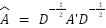
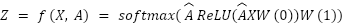
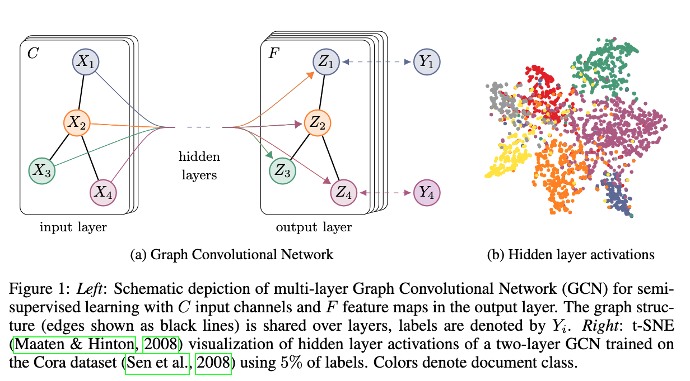
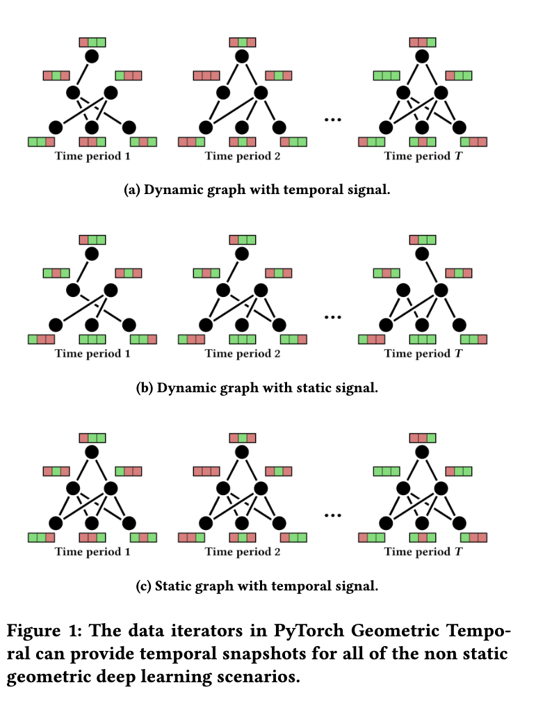

In my previous post, I mentioned that I’ve been exploring the use of graph methods in modeling and deep learning, some for work and some for my own hobby projects.  
Because I spent much of September traveling and resting before starting a new grad program, I haven’t had a lot of time recently for diving more into this topic, but I wanted to put together a short post summarizing the things I’ve learned so far to lay the groundwork for future posts on graph models.

## Technical background

I’ve been fascinated by graph theory ever since taking a combinatorics class back in college, and I wish I had more time that I could use to study the topic more deeply. Graph theory has a storied history stretching back to [Euler](https://en.wikipedia.org/wiki/Seven_Bridges_of_K%C3%B6nigsberg) in the eighteenth century, and the uses cases abound from route planning to recommendation systems.  I won’t go into the fundamentals of graph structures here, but you can find a number of good tutorials online; [this](https://huggingface.co/blog/intro-graphml) walkthrough from huggingface would be a good place to start.   
Prior to the big data revolution, graph models primarily focused on extracting features and calculating metrics for gaining insights. Some examples of node-level features would be centrality, degree, and the clustering coefficient; edge-level features included shortest distance, common neighbors, and Katz index (number of possible walks between nodes); examples of graph-level features would be total subgraphs and kernel methods for similarity scores.  
The sorts of features could be fed into classical algorithms that aimed to answer questions around centrality, shortest paths, types of subgraphs, etc. Neo4j has a good intro [guide](https://neo4j.com/blog/graph-data-science/graph-algorithms/) to these sorts of algorithms. [Neo4j](https://neo4j.com/docs/graph-data-science/current/getting-started/) is a popular system for storage, exploration, and modeling of graphs; I haven’t played around with it too much, but the visualizations definitely look pretty.

## The increasing relevance of graph models

Despite being studied for so long, graph models have only continued to grow in importance. Increasing data collection from social networking companies, streaming media services, and many others often deal with data where relationships between customers or products contain vital information for the sorts of questions being asked.  
Use cases for graph models fall into both supervised and unsupervised categories:

**Supervised tasks:**

* Node property prediction \- node classifcation, node regression  
* Link prediction \- whether or not a link should exist, and potentially what type  
* Graph property prediction \- structure of a graph, types of subgraphs

**Unsupervised tasks:**

* Representation learning \- generate features based on graph structure for another model  
* Clustering/Community Detection \- groups of nodes that go together  
* Similarity \- find pairs of nodes that go together; use cases such as recommendation, entity resolution  
* Centrality & Pathfinding \- find important entities in the graph, evaluate efficient paths and trees

Additionally, graphs can get huge. The combinatorial explosion of connections means that even for graphs where nodes only have a few connections on average, the size of the data structure can increase exponentially.   
Given this increase in size as well as relevance for graph data, many of these classical methods of studying graphs, as well as the standard table data structures in which databases often store them, can struggle to keep up.

With a prime source of big data (the graphs) and a plethora of use cases, the idea naturally arises to apply machine learning to the problem.

## Incorporation into Machine learning

Many of the types of deep learning architectures don’t transfer perfectly into the domain of graph structures, because they are unable to capture the information contained in the relationships between nodes communicated by links. The standard deep learning models have a tough time capturing the information contained within multiple connections, as well as aspects such as path directions. CNNs pull information from connections between a data point’s immediate neighbors, but they are limited in their reach. The Transformer comes closer as one could potentially envision encoding the graph’s adjacency matrix into some form of an attention matrix, where attention is capturing connection between nodes. However, another problem arises from the data structure itself. As that huggingface [post](https://huggingface.co/blog/intro-graphml) I linked earlier explained, for a neural net architecture to be able to accommodate graph structures it needs to be:

* permutation invariant: the representation of a graph and its permutations should be the same after going through the network  
* permutation equivariant: permuting the nodes before passing them to the network should be equivalent to permuting their representations

CNNs, RNNs, and the like do not satisfy these requirements.

To this end, a number of new Graph ML architectures have been [developed](https://research.google/blog/the-evolution-of-graph-learning/) in an attempt to fuse the benefits of neural networks with the intricacies of graph structures, and to make  learning on these huge structures feasible. After the foundation work of the [Graph Neural Network](https://ieeexplore.ieee.org/abstract/document/1517930) (GNN), later developments included [Graph Attention Networks](https://petar-v.com/GAT/), [GraphSAGE](https://snap.stanford.edu/graphsage/), and [Graph Isomorphism Networks](https://arxiv.org/pdf/1810.00826v3.pdf), but the most common type of model would probably be [Graph Convolutional Networks](https://tkipf.github.io/graph-convolutional-networks/).   
GCNs are based on encoding the graph data into matrices then plugging that data into convolutional layers, following a neural network architecture similar to others such as the LSTM.  The key insight is to encode the graph into a matrix built around the following equation:

Where A’ is the normalized adjacency matrix and D is the diagonalization. A good walkthrough of the derivation for this formula can be found [here](https://medium.com/@jrosseruk/demystifying-gcns-a-step-by-step-guide-to-building-a-graph-convolutional-network-layer-in-pytorch-09bf2e788a51).

The original GCN paper then defined the forward layer using the formula

The high level view of the system would then look like the diagram below, taken from the paper itself:  

[Source](https://arxiv.org/pdf/1609.02907)

In my work, we explored the use of GCNs for prediction tasks to forecast crop disease spread. To this end, we experimented with [STM-Graphs](https://arxiv.org/pdf/2104.07788) (Spatio-Temporal Graphs), because our data consisted of a mix of historical data types, such as weather recordings, and spatial data types, such as road networks. Basically, these models split each historical reading into a separate node, then chain them together to incorporate the spatial information. An implementation using PyTorch Geometric can be found [here](https://github.com/Ahghaffari/stm_graph). 

[Source](https://arxiv.org/pdf/2104.07788)

# Closing Thoughts

This post was a brief look at graph models in machine learning and their potential use cases. Hopefully I’ll give some deeper dives in the near future, and maybe even present some example cases, so stay tuned\!  