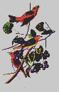

## Machine Learning Applications

[Audiobook Converter](https://github.com/8t88/audiobook_converter)
Program that takes a text file and converts it into an audiobook.

[Morning Maestro](https://github.com/8t88/Morning-Maestro) 
Web app for generating dawn songs from a selection of birds.

## Explorations

[Air Quality Analysis](https://github.com/8t88/Air-Quality)

## Visualizations

[Medieval Universities Map]()
Visualizing the establishment of European Universitites over the course of the Middle Ages
